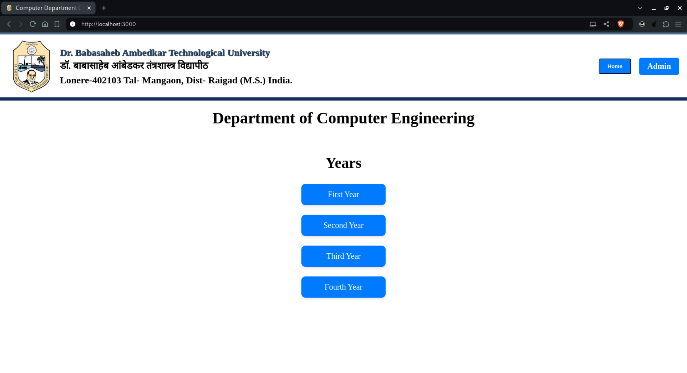
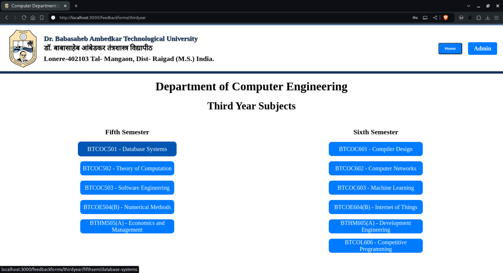
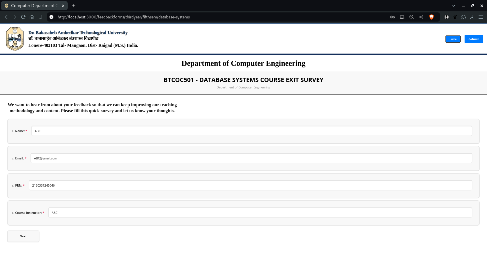
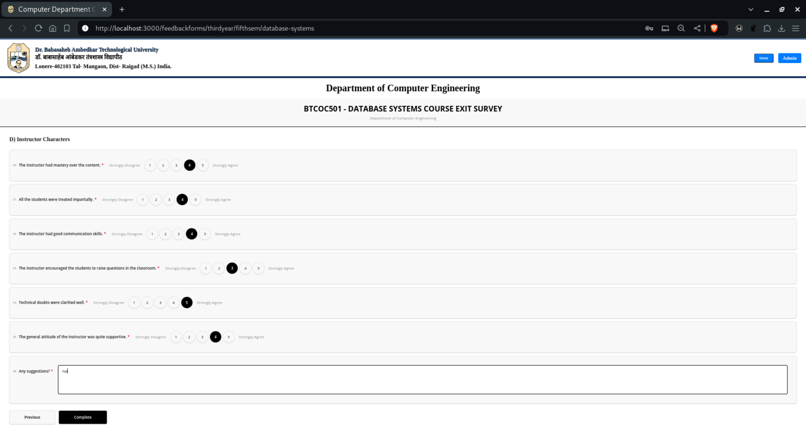
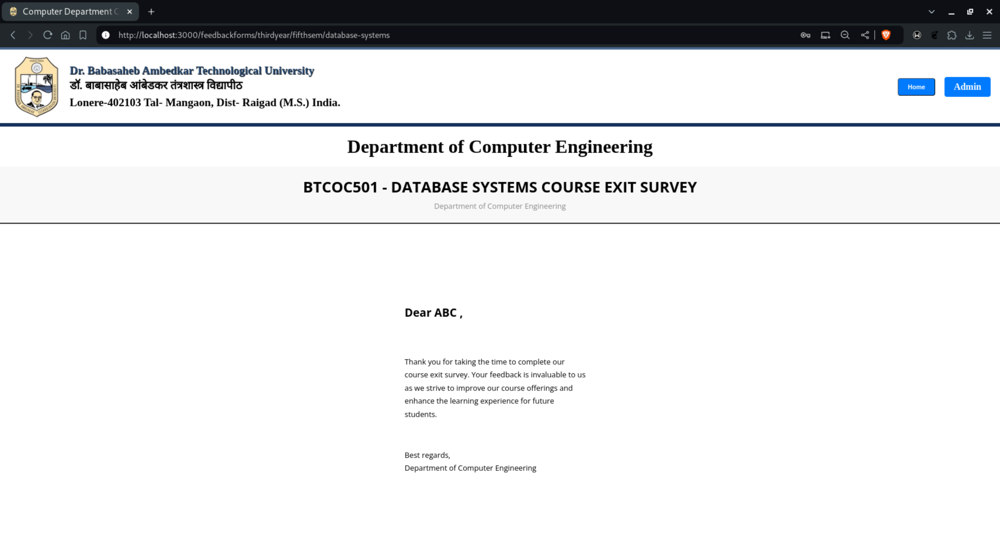
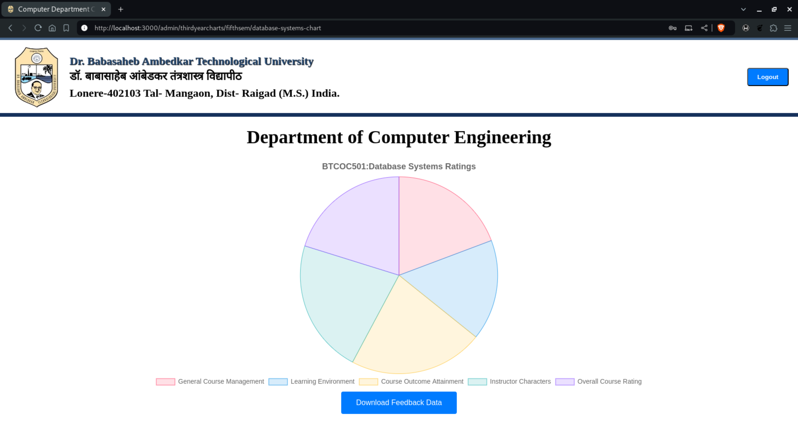

# Department Course Exit Survey
This project is a web application designed to collect feedback from students upon the completion of a course. The application utilizes various libraries and tools to create an interactive and user-friendly survey experience. It allows departments to gather insights on course effectiveness, teaching methods, and overall student satisfaction. The data collected can be used to make informed decisions on curriculum improvements and teaching strategies.

## Features
- Survey Creation and Management: Facilitates the design and deployment of course exit surveys.
- Real-time Data Collection: Utilizes Firebase for storing and managing survey responses.
- Data Visualization: Uses Chart.js and React-Chartjs-2 to visualize survey results, making it easier for administrators to analyze feedback.
- Responsive Design: Built with Bootstrap and React-Bootstrap to ensure a seamless experience across devices.
- Export Functionality: Allows exporting survey results to Excel files using the XLSX library for further analysis.

## Technologies Used
- Front-end: React, Bootstrap, React-Bootstrap, Styled-Components, React-Router-Dom, Chart.js, React-Chartjs-2
- Front-end Framework: React, Bootstrap, React-Bootstrap, Styled-Componenets
- Authentication: Firebase Authentication
- Backend: Firebase
- Database: Firebase Realtime Database
- XLSX Generation: xlsx library

## Screenshots

 

